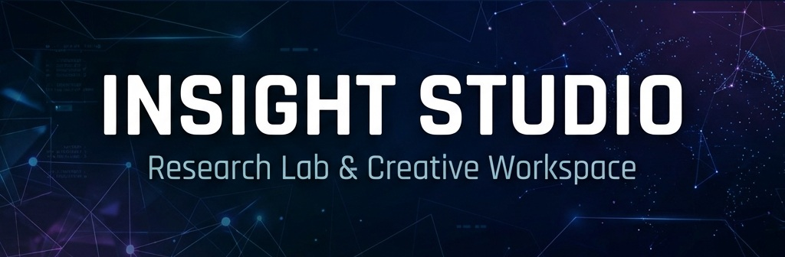

  

<h1 align="center">Insight Studio</h1>

  Research Lab & Creative Workspace for Digital Experiments

---

### 🧠 About

**Insight Studio** is a personal research lab and creative workspace.  
Here, code is not just written — it is explored, questioned, and shaped into coherent digital worlds.

From functional software tools to immersive storytelling, every project is treated as an experiment between **logic, design, and narrative**.

This space is where engineering meets curiosity.

---

### 🔬 Studio Philosophy

- Build with intention, not noise.  
- Treat software as a medium, not only a utility.  
- Explore before productizing.  
- Document ideas as living systems.  

Insight Studio grows through small, consistent experiments that later evolve into tools and products.

---

### 🧪 Labs

Labs are experimental projects — prototypes, research, and early concepts.

- **Academic Suite**  
  Research tools and educational utilities for structured learning.

- **Video Clipper (Python)**  
  Local experiment for automating video slicing and content extraction.

Labs may change shape, fail, or transform into tools.

---

### 🛠 Tools

Tools are stabilized labs — usable, structured, and documented.

- **Academic Suite**  
  Public utilities focused on learning workflows.

Tools aim to solve real problems with minimal friction.

---

### 📦 Products

Products are polished, published, and story-driven outputs.

- **Mastering .NET 10 (eBook)**  
  A practical and conceptual journey into modern .NET development.

- Future Digital Works  
  Including creative digital books, experiments, and interactive content.

Products focus on clarity, usability, and narrative value.

---

### ✍ Writing & Knowledge

Before publishing, ideas are written locally and refined.

- Articles (Markdown → dev.to)  
- Research notes  
- Technical storytelling  

Writing is treated as part of engineering, not a side activity.

---

### 🧭 Ecosystem

- [GitHub](https://github.com/insight105) — source code & experiments  
- [dev.to](https://dev.to/insight105) — articles & technical essays  
- [Amazon KDP](https://www.amazon.com/Mastering-NET-Development-Fundamentals-Developer-ebook/dp/B0GGRTZ7JG) — published eBooks   

Each channel represents a different expression of the same studio mind.

---

### 🚀 Current Focus

- Expanding **Academic Suite**  
- Refining **Mastering .NET 10** ecosystem  
- Building experimental automation tools  
- Designing creative digital products

---

### 🧑‍🚀 Insight Studio

> Code is a language.  
> Products are stories.  
> Labs are the place where both learn how to speak.

---

  Built with curiosity by <strong>Insight Studio</strong>

